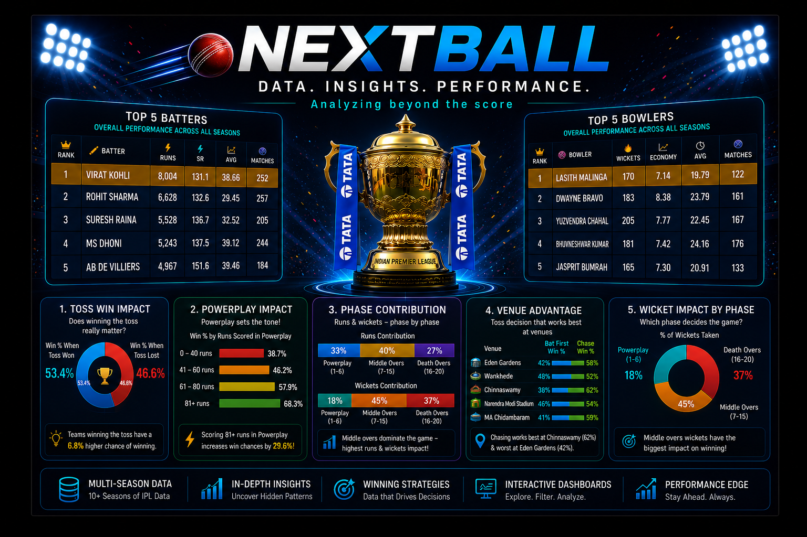

# NEXTBALL — Data-Driven IPL Match Analysis

## Overview
NEXTBALL is an interactive IPL analytics dashboard that uncovers winning patterns, toss impact, venue influence, and phase-wise match insights using ball-by-ball IPL data.

## Features
- Toss impact analysis
- Venue-wise winning trends
- Powerplay and death-over analysis
- Phase contribution insights
- Interactive batter and bowler leaderboards
- Season-wise filtering

## Technologies Used
- Python
- Pandas
- Plotly
- Jupyter Notebook

## Key Insight
Phase-wise performance influenced IPL match outcomes more consistently than toss advantage.

## Project Structure
- notebook.ipynb
- dataset.csv
- banner.png
- other images of charts and graphs
  

## Author
Ishwari hase

